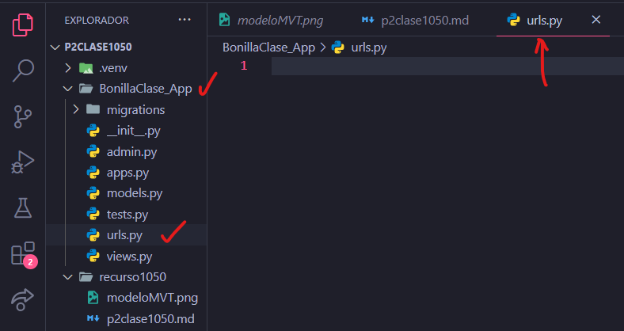
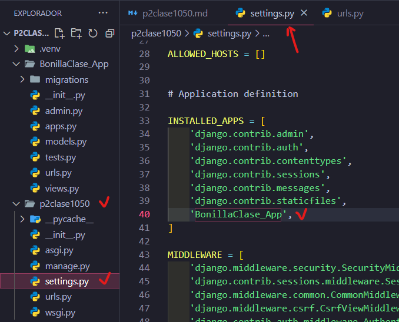
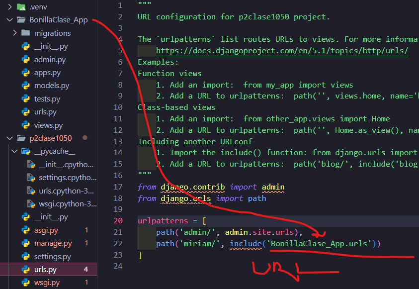
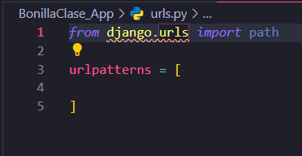
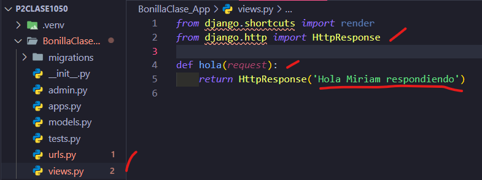
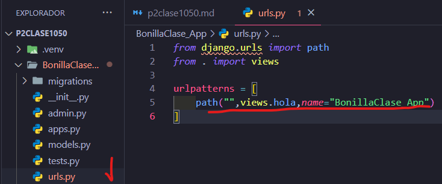

- Crear aplicacion BonillaClase_App
- Comando --> python manage.py startapp BonillaClase_App
- Creamos el archivo urls.py

- En setting.py de p2clase1050

- En urls.py de p2clase1050

- En urls.py de BonillaClase_App

- En views.py en BonillaClase_App

- En urls.py de BonilaClase_App
